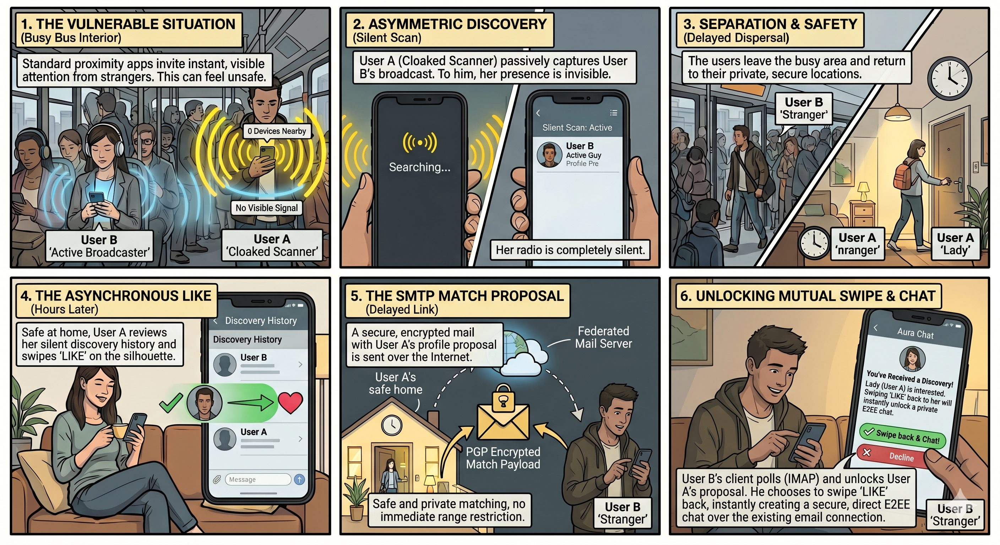
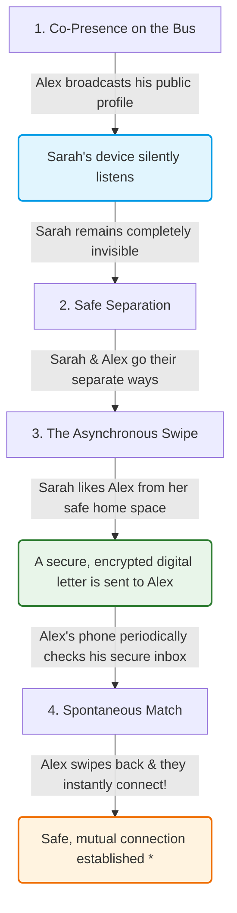

# Ghost Mode & Safe Matching: How AuraRadar Protects You in Public

Have you ever used a location-based app and felt uneasy about who might see you? 

In a crowded space--like a bus, a train, or a busy coffee shop--being visible on a digital map can feel downright unsafe. If standard location apps alert people nearby to your exact presence instantly, it creates a serious safety risk: someone could scan the room, identify you physically, and make an unwanted approach before you have even had a chance to vet them or give consent.

At **AuraRadar**, we call this the **Transit Space Nightmare**. 

We solved this problem using a powerful design concept: **Asymmetric Discovery (Ghost Mode)** paired with secure, private matching that doesn't rely on centralized servers. Here is a simple, non-technical guide to how it works.

---

## 1. The Core Idea: Ghost Mode

Instead of everyone broadcasting their location to everyone else all the time, AuraRadar lets you choose how you want to appear in public:

* **Active Broadcasters** (like Alex): People who are open to being discovered and are actively sharing their digital "vibe tags" and public profile info over a short-range local mesh network.
* **Stealth Scanners / Ghost Mode** (like Sarah): People who want to see who is around, but want to remain **completely invisible** while doing so. 

When Sarah is in **Ghost Mode**, her phone does not transmit a single wireless signal. It is completely silent. However, her phone is still listening. It can pick up Alex's broadcast, verify he is nearby, and save a temporary "silhouette" of his profile on her phone--all while Alex has absolutely zero knowledge that Sarah is even in the same room.

---

## 2. Visualizing the Concept

Here is how this dynamic plays out in real life:

---

## 3. The Match Journey: Step-by-Step

Let's follow **Sarah** (our cloaked scanner) and **Alex** (our active broadcaster) as they cross paths on a city bus.

### Phase 1: Silent Co-Presence
While riding the bus, Alex's phone is broadcasting his profile. Sarah is sitting a few rows back in **Ghost Mode**. Her phone passively registers Alex's profile and saves it to a private history list stored *only* on her phone. Because her phone remains radio-silent, Alex's device has absolutely no record of Sarah. **She is 100% invisible.**

### Phase 2: Heading Home
The bus ride ends. Alex gets off at his stop, and Sarah returns to the comfort and safety of her own home. There is no risk of an immediate, awkward, or unsafe physical approach.

### Phase 3: The "Swipe" & The Locked Letter
Later that evening, in her safe space, Sarah browses her local history, sees Alex's profile, and decides she wants to connect. She swipes "Like". 

Because they are no longer near each other, local short-range wireless won't work. Instead, Sarah's phone acts like a high-tech post office:
1. It takes her profile and locks it inside a **digital envelope** (using advanced encryption).
2. This envelope is uniquely locked so that **only Alex's phone** has the mathematical key to open it.
3. Her phone sends this envelope as an encrypted email directly to a secure address associated with Alex's app.

### Phase 4: Receiving the Match
In the background, Alex's phone periodically checks his secure inbox. When it downloads Sarah's locked envelope:
* His phone decrypts the envelope to see Sarah's profile.
* If Alex had already seen Sarah's profile (or sees it now in his "remote discoveries" list) and swipes "Like" back, the match is completed!
* Both phones instantly notify them: *"Spontaneous Match Resolved! *"*

---

## 4. Why This Approach is a Game-Changer

> [!NOTE]
> By splitting the matching process into two steps--**silent in-person listening** and **delayed, encrypted online matching**--AuraRadar gives you the best of both worlds: spontaneous real-world connections and complete peace of mind.

* **Real Physical Safety**: You are never forced to reveal your identity or presence in a crowded, vulnerable space. You choose exactly when and where to reach out.
* **No Centralized Servers**: Traditional dating and social apps keep massive databases of your exact location history and everyone you like. AuraRadar does not. Your profile, your location data, and your matches live strictly on your own device.
* **Automatic & Seamless**: The app handles all of this complex cryptography and networking in the background. To you, it just feels like magic.
