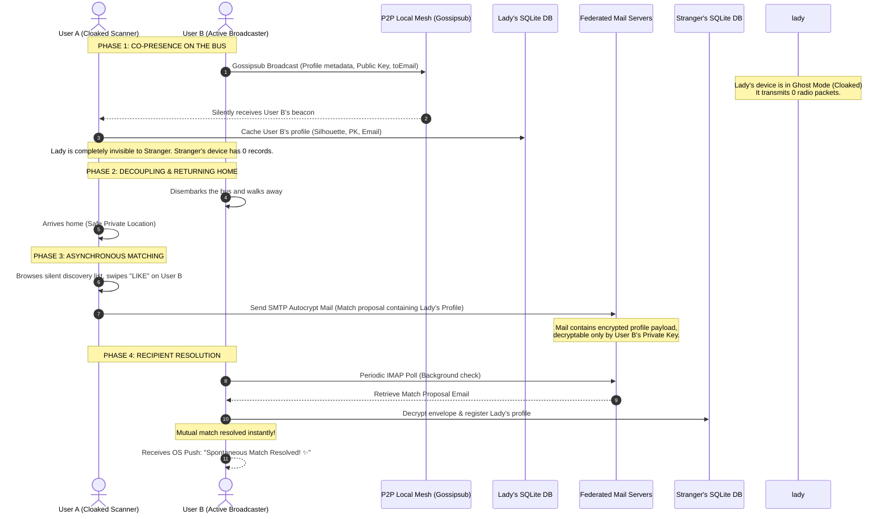

# Asymmetric Proximity-to-Email Matching Scenario

This document details the step-by-step user scenario and technical execution flow of the **Transit Safety Paradox** and how AuraRadar resolves it using **Asymmetric Discovery** and the **SMTP/IMAP Chat Bridge**.

---

## 1. The Scenario: The Confined Transit Space (Bus Scenario)

The typical central safety problem of proximity-based discovery is the **Transit Space Nightmare**:
* **The Situation**: A safety-conscious user (User A, typically a female passenger) is riding a bus or train. Multiple standard users (User B, active broadcasters) are in the same vehicle.
* **The Threat**: If User A operates in standard broadcast mode, User B's device instantly receives a proximity push notification. User B might immediately scan the bus, identify her, and attempt a cold physical approach before she has vetted him or given digital consent.
* **The Solution**: User A operates in **Stealth Scan (Ghost Mode)**.

---

## 2. Comic Concept Illustration

Here is a visual representation of this dynamic:

---

## 3. Step-by-Step Walkthrough

---

## 4. Detailed Data Flow Mechanics

### Phase A: Local Silent Scan (Co-presence)
1. **User B (Broadcaster)**'s device continuously advertises its profile beacon over the local P2P mesh network (`libp2p` Gossipsub). The profile beacon includes:
   * Public ID
   * Non-physical vibe tags
   * Paillier public key (for zero-knowledge distance challenges)
   * Public contact tag (SMTP address, e.g., `user_b@auramail.net`)
2. **User A (Cloaked Scanner)**'s device runs in Stealth Scan. It is completely silent on the radio airwaves. It passively captures User B's beacon.
3. User A's client computes the Zero-Knowledge distance verification locally and writes User B's profile to her local history database.
4. **The Critical Safety State**: Because User A's radio remained completely silent, User B's device is completely unaware she exists. There is **zero possibility of visual triangulation or immediate cold approaches**.

### Phase B: Delayed Match Proposal (Asynchronous SMTP)
1. Hours later, User A is in a safe location. She reviews her local history screen, finds User B's Silhouette, and swipes **"Like"**.
2. Because they are no longer in proximity, local Gossipsub/mDNS is offline.
3. User A's client generates a **Stealth Match Proposal** payload containing:
   * Her profile data (name, bio, public key)
   * Her cryptographic signature confirming her "Like".
4. The client retrieves User B's public key from the cached discovery record and encrypts the payload.
5. The client transmits the encrypted package as an email via standard **SMTP** to User B's federated email address (`user_b@auramail.net`).

### Phase C: Background Ingestion & Resolution (Asynchronous IMAP)
1. User B's background app client periodically polls his federated inbox using **IMAP**.
2. Upon downloading the match proposal email, the client:
   * Decrypts the payload using User B's private key.
   * Records User A's profile in the local SQLite database.
   * Automatically records User A's interaction type as `like`.
3. **Mutual Verification check**:
   * If User B has *already* swiped "Like" on the anonymous silhouette he saw on the bus, a mutual match resolves **instantly**, popping up a notification: *"Spontaneous Match Resolved! ✨"*
   * If User B has not swiped yet, User A's profile is added to his discoveries list (clearly badged as a **"Remote Discovery"**), allowing him to swipe back and complete the match.

---

## 5. Architectural Advantages

1. **Perfect Spatial Security**: The vulnerable party is never visible during the in-person encounter, preventing any immediate threat, visual stalking, or physical boundaries mapping.
2. **Zero Centralized Servers**: Matching does not rely on a centralized dating database. All profiles are stored on user devices, and match proposals are delivered directly through secure, end-to-end encrypted emails.
3. **Hybrid Transport Fallover**: The transition between real-time local mesh (Gossipsub) and asynchronous federated channels (SMTP/IMAP) is completely automated, providing a seamless user experience at any range.
