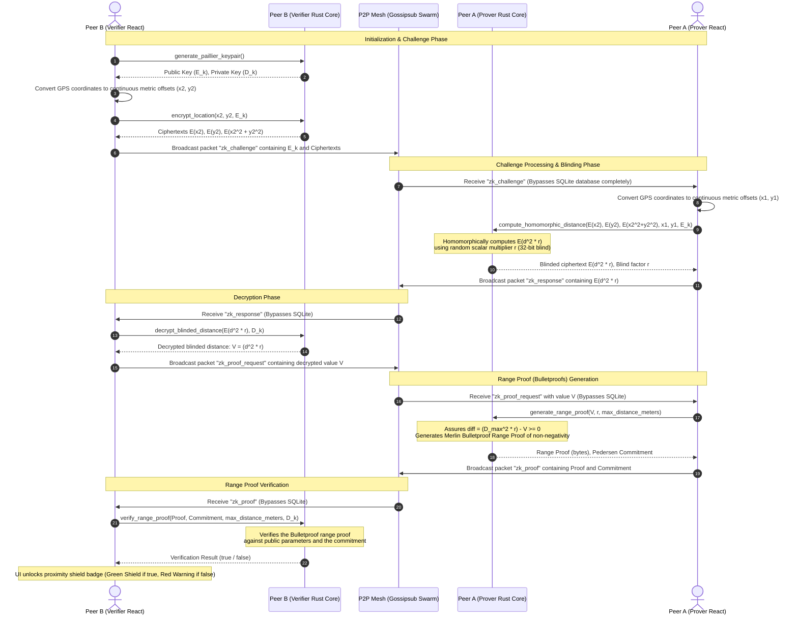

# Aura Repository Map & Data Flow

Welcome to the **Aura** codebase mapping! This document serves as a guide to help contributors and developers understand the Unix-style repository organization, module breakdown, and technical data flows driving this local-first, zero-knowledge privacy-preserving proximity network.

---

## 1. 3-Character Repository Architecture

Following a strict Unix-style directory structure, every top-level folder has a name exactly **three letters** long. Symlinks are used to maintain compatibility with conventional build pipelines and package managers.

```
aura/
├── bld/          # Build and deployment scripts (e.g., build_release.sh, deploy_to_all.sh)
├── cnf/          # Front-end configuration (React, Vite, TSConfig, package.json)
│   ├── src/      # React Native / Web TSX screen components and custom hooks
│   └── index.html
├── dep/          # Frontend node_modules dependency folder (symlinked as cnf/node_modules)
├── doc/          # Project documentation, mathematical guides, and todo lists
│   ├── map.md    # [This File] Directory mapping and data flows
│   └── todo.md   # Project milestone checklist
├── mdt/          # App metadata recipes and packaging definitions (e.g., F-Droid)
├── out/          # Unified compiler targets
│   ├── rust-target/ # Cargo intermediate NDK/local compiled objects
│   └── web-dist/    # Production Web client assets built by Vite (isolated from rust)
├── pub/          # Staged build artifacts ready for public deployment (.apks, tag packages)
├── res/          # Public-facing resources, fonts, icons, and static images
├── src/          # Rust/Tauri native core components
│   └── core/     # Native application runtime, libp2p network swarm, and cryptography
└── web/          # Static web views and HTML templates
```

---

## 2. Component Directory & Module Breakdown

### A. Front-end UI Components (`cnf/src/`)
* **[App.tsx](file:///home/bensiv/Projects/aura/cnf/src/App.tsx)**: Root component managing light/dark context themes, swipe screen loading, and stateful side-drawer navigation.
* **[screens/SettingsScreen.tsx](file:///home/bensiv/Projects/aura/cnf/src/screens/SettingsScreen.tsx)**: Handles settings state and configurations, including the interactive **ZK Proximity Threshold Slider** (10m to 500m).
* **[components/SwipeCard.tsx](file:///home/bensiv/Projects/aura/cnf/src/components/SwipeCard.tsx)**: Render layer for local resonance cards, wired up with rotating loaders and cryptographic shield badges for real-time ZK handshake states.
* **[hooks/useResonance.ts](file:///home/bensiv/Projects/aura/cnf/src/hooks/useResonance.ts)**: The primary front-end orchestrator. Manages:
  1. GPS tracking.
  2. Local equirectangular flat-meter coordinate projection.
  3. Interactive ZK proximity handshake state machine (from challenge generation to Bulletproof range verification).

### B. Native Backend Core (`src/core/src/`)
* **[lib.rs](file:///home/bensiv/Projects/aura/src/core/src/lib.rs)**: Tauri app orchestrator. Binds SQLite/SQLCipher, registers Tauri async commands, and initializes the P2P libp2p Gossipsub network threads.
* **[mesh.rs](file:///home/bensiv/Projects/aura/src/core/src/mesh.rs)**: Swarm manager implementing Gossipsub, Kademlia, and mDNS discovery. Integrates the **Store-Carry-Forward (SCF)** transient caching loop and includes gossip packet interceptors to bypass SQLite for transient `zk_` packet traffic.
* **[zk_distance.rs](file:///home/bensiv/Projects/aura/src/core/src/zk_distance.rs)**: Cryptographic engine implementing additive homomorphic calculations (via Paillier) and zero-knowledge range proofs (via Merlin transcript bulletproofs).

---

## 3. The ZK Proximity Verification Data Flow (Paradigm B)

This sequence diagram outlines the continuous Additive Homomorphic projection challenge-response cycle between two peer nodes (**Peer A - Prover** and **Peer B - Verifier**). This flow allows Peer B to verify if Peer A is within $D_{max}$ meters *without* either node ever leaking their absolute GPS coordinates in the clear.



---

## 4. Key Architectural Decisions & Data Flow Optimizations

### 1. Database-Bypass Network Interceptors
To prevent rapid, continuous proximity handshakes from polluting the persistent SQLite state tables (which would cause write-amplification and lag on low-end mobile devices), **`mesh.rs`** intercepts Gossipsub packets containing a `msg_type` starting with `"zk_"`.
* Transient packet flows are directly emitted to the React UI layer using Tauri events.
* They completely bypass SQLite database persistence.
* **Result**: Zero write overhead for continuous real-time range-proof exchanges.

### 2. Latitude-Adjusted Equirectangular Projections
To enable continuous $L_2$ Euclidean distance arithmetic inside the homomorphic Paillier cipher, spherical GPS coordinates are mapped to local flat metric coordinate projections in React before calling native commands:
* **Latitude delta**: $\Delta x = \Delta \text{lon} \times 111,000 \times \cos(\text{lat}_{\text{rad}})$ meters.
* **Longitude delta**: $\Delta y = \Delta \text{lat} \times 111,000$ meters.
* Coordinates are scaled by **$1000\times$** prior to encryption, preserving sub-millimeter level measurement precision during the integer-bound Paillier arithmetic.

### 3. Bulletproofs over SNARKs for Handshakes
* **Paradigm B** uses **Bulletproofs** for the range proof of $\Delta = (D_{max}^2 \cdot r) - (d^2 \cdot r) \ge 0$.
* Unlike spatial SNARKs (like Groth16), Bulletproofs require **zero trusted setup**.
* Proof sizes are extremely small (logarithmic in the bit length of the range proof), making them highly optimized for transport over cellular/mesh links.
